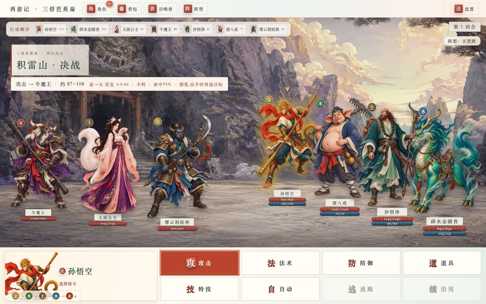

<p align="center">
  
</p>

<h1 align="center">NovelToGame</h1>

<p align="center">
  <b>A source-grounded novel-to-game workflow: adaptation design, target-runtime builds, and evidence-based QA.</b>
</p>

<p align="center">
  <a href="https://zenstory.ai/novel-to-game"><b>Project page</b></a>
  &nbsp;·&nbsp;
  <a href="#play-online"><b>Play online</b></a>
  &nbsp;·&nbsp;
  <a href="#quick-start"><b>Quick start</b></a>
  &nbsp;·&nbsp;
  <a href="README_ZH.md"><b>中文</b></a>
</p>

<p align="center">
  <a href="https://github.com/zenstory-ai/novel-to-game/stargazers"></a>
  <a href="https://github.com/zenstory-ai/novel-to-game/releases/latest"></a>
  
  <a href="https://github.com/zenstory-ai/novel-to-game/actions/workflows/validate.yml"></a>
  <a href="./LICENSE"></a>
</p>

<p align="center">
  <a href="https://github.com/zenstory-ai/novel-to-game/discussions"></a>
  <a href="https://github.com/zenstory-ai/novel-to-game/issues"></a>
</p>

NovelToGame is an open-source Agent Skills toolkit for Claude Code, Codex, and Kimi Code. Give your coding agent a novel and a target platform or engine; it works through source analysis, concept selection, world and art direction, the build, and runtime QA, and hands you a playable game plus the design documents behind it.

The novel can be in any language, and generated artifacts follow the language you ask for. The build and QA run on the platform or engine you chose.

## Play Online

Three playable adaptations, each open in a browser right now and linked to the case study behind it: source provenance, concept trade-offs, game and art direction, runnable source, and evidence from the playable paths.

### Journey to the West · Three Borrowings of the Banana Fan

[](https://xiyouji.vibecoco.ai)

**One wave of a fan blew you fifty thousand li. Take the mountain back one turn at a time.**

Command Wukong's party through the three borrowings of the Banana-Leaf Fan: read the five-element wheel, follow a fire-vein treasure map, decide when to press deeper or bank the haul, transform your way in where force will not work, and turn a demon king who outclasses you into a rainstorm over the Mountain of Flames.

**[Play in browser](https://xiyouji.vibecoco.ai)** · [Read the case study](examples/journey-to-the-west/) · design estimate: 45–90 min · all ages · playable prototype

### Jin Ping Mei · Ledger of Desire

[](https://jinpingmei.vibecoco.ai)

**Choose whose door you enter tonight. Find out whose door knocks in the morning.**

Twenty days, five courtyards. Keep silver, influence, reputation, exposure, and household strain in balance; respect each woman's terms; build trust through shared crises; and face a final ledger shaped by what everyone chose and remembers.

**[Play in browser](https://jinpingmei.vibecoco.ai)** · [Read the case study](examples/jin-ping-mei/) · design estimate: 60–90 min · 18+ · playable prototype

### Project Plateau · The Lost World · 3D

A real-time **first-person 3D field-photography game** adapted from Arthur Conan Doyle's *The Lost World*. Cross a connected plateau, observe a living Iguanodon family, expose four glass plates under aerial pressure, and return with the views that survived.

Play the full expedition on desktop, or watch the 15-second gameplay preview on other devices.

https://github.com/user-attachments/assets/27819247-4e4d-4bf0-8f0f-43d4125c4d45

**[Play in your browser — no install](https://plateau.vibecoco.ai)** · [Read the case study](examples/project-plateau/) · [Share feedback](https://github.com/zenstory-ai/novel-to-game/discussions/7) · 1–3 min run · desktop WebGL2 · playable prototype

## Why NovelToGame

A one-line "turn this book into a game" prompt often produces a generic reskin or a clickable plot summary. NovelToGame keeps the adaptation traceable and gives each major decision a clear owner:

- **Source-grounded adaptation:** extract rules, spaces, character agency, conflicts, and visual anchors with citations;
- **Real game design:** turn source evidence into player verbs, systems, levels, feedback, failure, and outcomes;
- **Target-runtime delivery:** build for the platform or engine you approved, so implementation cannot quietly redesign the game;
- **Optional, restrained voice:** synthesize only selected high-value lines at build time, keep subtitles and mute fallbacks, and never send the whole novel to a TTS provider by default;
- **Evidence-based QA:** verify startup, rendering, input, the core loop, an outcome, restart, and explicit limitations in the tested runtime.

## Quick Start

### 1. Install the seven skills

| Agent CLI | Install | Invoke |
|---|---|---|
| Claude Code | `npx skills add zenstory-ai/novel-to-game -g -y -a claude-code -s '*'` | `/novel-to-game` |
| Codex | `npx skills add zenstory-ai/novel-to-game -g -y -a codex -s '*'` | `$novel-to-game` |
| Kimi Code | `npx skills add zenstory-ai/novel-to-game -g -y -a kimi-code-cli -s '*'` | `/skill:novel-to-game` |

<details>
<summary><strong>All three CLIs at once, or native plugin installation</strong></summary>

Install adapters for all three CLIs on the same machine:

```bash
npx skills add zenstory-ai/novel-to-game -g -y -s '*' \
  -a claude-code -a codex -a kimi-code-cli
```

Cloning the repository also enables project-local skill discovery in all three CLIs.

#### Claude Code

```text
/plugin marketplace add zenstory-ai/novel-to-game
/plugin install novel-to-game@novel-to-game-skills
/novel-to-game:novel-to-game quick
```

#### Codex

```bash
codex plugin marketplace add zenstory-ai/novel-to-game
codex plugin add novel-to-game@novel-to-game-skills
```

#### Kimi Code 0.27 or newer

```text
/plugins install https://github.com/zenstory-ai/novel-to-game
/reload
/skill:novel-to-game quick
```

</details>

### 2. Start an adaptation

Give the agent a novel file, directory, or link, then copy one of these requests and adjust it.

**A systems game with a new playable route:**

```text
Use novel-to-game quick to adapt this novel into a fully playable game.
Recommend the target platform, genre, and engine from the source, and keep the first build to about 15 minutes.
Let the player enter the world as an original character with a new playable route through its conflict.
```

**An interactive story** (this locks the `narrative-led` experience profile, so concept, design, and QA judge continuous scenes, character dialogue, testimony, and key choices instead of rounds, cards, and resource bars):

```text
Use novel-to-game quick to adapt this novel into an interactive story.
Carry the experience with continuous scenes, character dialogue, testimony, and key choices.
Keep variables as hidden causal tags rather than a visible stat panel.
Key choices must change later scenes, character attitudes, and the ending, and be named back in later text.
```

The narrative track keeps the same agency and runtime-evidence requirements; questioning people, pressing contradictions, and changing attitudes can carry the player loop.

**Design notes only, no build yet:**

```text
Using my authorized source, plan one small gameplay-design slice for my target engine.
Keep the choices and outcomes bounded; show each option's evidence, cost, visible effect, and where a later scene uses its state.
Label allowed additions and unresolved questions. Deliver design notes only—do not build, run QA, or claim a finished runtime.
```

`quick` is the low-friction mode: the agent drafts sensible defaults, asks only about choices that materially change direction or touch safety, compares meaningful alternatives, and continues through design, build, and QA. Choose `director` when you want to pick the concept yourself.

## Workflow

The orchestrator locks `PRODUCT_BRIEF.md`, then hands the adaptation through separately owned decisions. Concept, experience/level design, and art direction remain distinct. After world design, a risk-matched whitebox tests the hardest causal, systemic, spatial, or control question before art production; its findings return to the design owner.

```text
Novel → Source analysis → Concept → World design → Risk-matched whitebox ↺ → Art direction → Production build → QA → Playable game
```

The whitebox runs only the narrow check needed for its declared risk. The production build targets the chosen runtime and prepares one authoritative verification entry point. QA may diagnose, fix, and rerun; its final record binds all six player-visible effects to the same complete execution. Capability-specific regression checks run only when that capability is adopted.

## Skills

| Skill | Responsibility |
|---|---|
| [`novel-to-game`](skills/novel-to-game/) | Confirm requirements, choose a mode, orchestrate stage handoffs, and recover progress |
| [`novel-game-analyze`](skills/novel-game-analyze/) | Extract cited rules, verbs, spaces, agents, systems, and signature moments |
| [`game-concept`](skills/game-concept/) | Compare meaningful alternatives, reject invalid options, and select or validate a direction |
| [`game-world-design`](skills/game-world-design/) | Define the player promise, core loop, world response, systems, levels, failure, and outcomes |
| [`game-art-direction`](skills/game-art-direction/) | Define camera, composition, visual grammar, colour, light, materials, HUD, motion, and sound |
| [`game-build`](skills/game-build/) | Build a risk-matched whitebox, then implement the approved production candidate without redesigning it |
| [`game-qa`](skills/game-qa/) | Verify commands, states, screenshots, and real play paths without overstating subjective results |

## Artifacts

Each run creates a compact, self-contained adaptation workspace:

```text
game-adaptations/<project>/
  PRODUCT_BRIEF.md
  analysis/SOURCE_BIBLE.md
  concepts/CONCEPT.md
  design/GAME_DESIGN.md
  design/ART_DIRECTION.md
  build/BUILD_BRIEF.md
  build/app/
  qa/verification.json
  _progress.md
```

The design documents are engine-agnostic Markdown you own. The target runtime you approve determines the implementation and QA environment.

## Further reading

- [Quick-start guide](https://zenstory.ai/novel-to-game/quick-start) — scope a first adaptation: separate authorized source facts, author-approved additions, and open questions, and keep the first slice small.
- [Meaningful-choice guide](https://zenstory.ai/novel-to-game/meaningful-choices) — give each player option evidence, cost, and a visible outcome, and name the later scene that reads its state.
- [NovelToGame compared with story-to-game builders](docs/novel-to-game-vs-story-to-game-tools.md) — the three shapes of tool and where the design documents live.

## Contributing

Reproducible bugs, skill gaps backed by evidence, and example proposals that demonstrate a distinct adaptation lesson are welcome. Read the [contribution guide](CONTRIBUTING.md) and use the repository's structured issue and pull request templates.

## License

NovelToGame is released under the [MIT License](LICENSE).

## Acknowledgments

Thanks to the [linux.do](https://linux.do) community for early feedback and support.

## Part of ZenStory AI

This project is maintained by [ZenStory AI](https://zenstory.ai) — open-source, agent-native tools for creating, adapting and producing stories (GitHub org: [zenstory-ai](https://github.com/zenstory-ai)). Sibling projects:

| Project | What it does |
| --- | --- |
| [oh-story-claudecode](https://github.com/zenstory-ai/oh-story-claudecode) | Web-fiction writing skill pack: chart scanning, deconstruction, drafting, de-AI-flavor, covers |
| [drama-skills](https://github.com/zenstory-ai/drama-skills) | AI short-drama / motion-comic suite: scripts, assets, storyboards, image & video prompts, review |
| [novel-to-game](https://github.com/zenstory-ai/novel-to-game) | Agent skills for source-grounded novel adaptation, target-runtime builds, and evidence-based QA (this repo) |
| [video-recap-skills](https://github.com/zenstory-ai/video-recap-skills) | Create Chinese-narration recaps from supported video files, with optional editable JianYing/CapCut draft export |
| [oh-story-dsh](https://github.com/zenstory-ai/oh-story-dsh) | Community DeepSeek Harness plugin with novel, short-drama, game and video-recap workbenches |
| [zenstory](https://github.com/zenstory-ai/zenstory) | Chat-to-create AI novel-writing workbench ([app.zenstory.ai](https://app.zenstory.ai)) |
