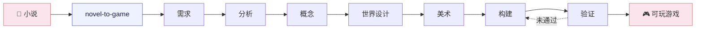

# NovelToGame

> 把任何语言的小说，变成有原著依据、可完整游玩的网页游戏。

[](https://github.com/worldwonderer/novel-to-game/actions/workflows/validate.yml)
[](LICENSE)

NovelToGame 是一套面向 Claude Code、Codex 和 Kimi Code 的开源 Agent Skills。它负责的不是把原文套进对话框，而是把小说特有的规则、空间、势力和冲突变成玩家动作、系统、关卡与可验证的完整流程。

[English](README_EN.md) · [立即安装](#安装) · [快速开始](#快速开始) · [查看产出结构](#产出)

## 先玩成品

| 《西游记》· 三借芭蕉扇 | 《金瓶梅》· 风月总账 |
|---|---|
| [](https://xiyouji.vibecoco.ai) | [](https://jinpingmei.vibecoco.ai) |
| 回合制系统 RPG：五行、阵型、变化、携宠与多阶段 Boss | 18+ 关系策略游戏：六日日程、角色意志、资源债与三种收束 |
| **[在线试玩](https://xiyouji.vibecoco.ai)** · [完整工件](examples/journey-to-the-west/) · [原著出处](examples/journey-to-the-west/source/SOURCE.md) | **[在线试玩](https://jinpingmei.vibecoco.ai)** · [完整工件](examples/jin-ping-mei/) · [原著出处](examples/jin-ping-mei/source/SOURCE.md) |

两个示例都包含原著来源、产品约束、游戏化拆解、概念取舍、世界与美术设计、构建说明以及可运行源码。下一份英文示例正在把同一流程带入**第一人称 3D 探索**，验证它并不局限于文字或叙事类游戏。

## 快速开始

安装后，把小说文件、目录或链接交给 Agent：

```text
用 novel-to-game quick 把这本小说做成一个 15 分钟可完整游玩的网页游戏。
玩家以原创身份进入世界，不要逐段复演原作剧情。
```

`quick` 会自动选择证据最强的方向；想在世界设计之前从三个方案里亲自选择，就使用 `director`。

## 它解决什么

直接让模型“把这本书做成游戏”，经常只会得到换皮玩法或可点击的剧情摘要。NovelToGame 把最需要判断力的部分拆成明确关卡：

- **先锁产品边界**：平台、类型、目标体验、画风、分级、引擎和不可改写项；
- **再找可玩的原著证据**：规则、动作、空间、角色意志、系统与视觉锚点；
- **让概念、关卡和美术各自负责**：实现阶段不能静默重做策划；
- **以真实运行收尾**：启动、输入、状态变化、完整流程、结果、重开和目标视口都必须留下证据。

输入小说可以是任意语言；生成工件默认跟随用户要求或对话语言，并保留必要的原文引证与术语表。

## 安装

### Agent Skills

为你使用的 CLI 安装全部七个技能：

| Agent CLI | 安装命令 | 调用方式 |
|---|---|---|
| Claude Code | `npx skills add worldwonderer/novel-to-game -g -y -a claude-code -s '*'` | `/novel-to-game` |
| Codex | `npx skills add worldwonderer/novel-to-game -g -y -a codex -s '*'` | `$novel-to-game` |
| Kimi Code | `npx skills add worldwonderer/novel-to-game -g -y -a kimi-code-cli -s '*'` | `/skill:novel-to-game` |

同时安装三端：

```bash
npx skills add worldwonderer/novel-to-game -g -y -s '*' \
  -a claude-code -a codex -a kimi-code-cli
```

克隆仓库后，三端也能发现项目内的七个技能。

### 原生插件

Claude Code：

```text
/plugin marketplace add worldwonderer/novel-to-game
/plugin install novel-to-game@novel-to-game-skills
/novel-to-game:novel-to-game quick
```

Codex：

```bash
codex plugin marketplace add worldwonderer/novel-to-game
codex plugin add novel-to-game@novel-to-game-skills
```

Kimi Code 0.27 或更高版本：

```text
/plugins install https://github.com/worldwonderer/novel-to-game
/reload
/skill:novel-to-game quick
```

## 流程

总入口先冻结 `PRODUCT_BRIEF.md`，再串起六个职责分离的阶段；验证失败会回到构建，而不是用文字结论替代修复。



需求阶段会锁定平台、游戏类型与联网核实的对标、美术方向、内容分级、核心幻想和引擎。下游必须遵守这些边界，不能在实现时悄悄换成更容易做的游戏。

## 七个技能

| 技能 | 职责 |
|---|---|
| `novel-to-game` | 总入口：需求 intake、模式选择、阶段编排与进度恢复 |
| `novel-game-analyze` | 提取规则、动作、空间、角色、系统与名场面，形成有引证的设定集 |
| `game-concept` | 生成三个真正不同的方向，用硬否决与取舍选出一个 |
| `game-world-design` | 定义玩家承诺、核心循环、世界响应、系统、关卡、失败与结果 |
| `game-art-direction` | 定义镜头、构图、视觉语法、色光材质、HUD、动效与声音 |
| `game-build` | 压缩构建说明，驱动编码智能体实现可完整游玩的原型 |
| `game-qa` | 用命令、状态、截图与实际游玩路径验证构建，不伪装主观结论 |

## 产出

每次运行创建一个紧凑、自包含的改编工作区：

```text
game-adaptations/<project>/
  PRODUCT_BRIEF.md
  analysis/SOURCE_BIBLE.md
  concepts/CONCEPT.md
  design/GAME_DESIGN.md
  design/ART_DIRECTION.md
  build/BUILD_BRIEF.md
  build/app/
  qa/QA_REPORT.md
  _progress.md
```

核心设计工件不绑定某个模型或前端框架；构建阶段再根据已批准的设计选择合适实现。

## 示例工件

### 《西游记》· 三借芭蕉扇

从完整公版百回本提炼的回合制指令 RPG。玩家不是复述原著，而是利用五行、阵型、携宠和变化，在多阶段 Boss 战中完成新的行动闭环。

**[在线试玩](https://xiyouji.vibecoco.ai)** · [运行源码](examples/journey-to-the-west/build/app/) · [构建说明](examples/journey-to-the-west/build/BUILD_BRIEF.md) · [QA 报告](examples/journey-to-the-west/qa/QA_REPORT.md)

| 战斗 | 碧波潭 | 主角面板 |
|---|---|---|
|  |  |  |

### 《金瓶梅》· 风月总账

从公版崇祯本重制的六日男性第一人称关系策略游戏。白日经营钱、势与秘密，夜里推进三条独立深线，次日承担人物和宅院对前一日选择的回应。

**18+；亲密内容由关系选择和明确意愿门控。** **[在线试玩](https://jinpingmei.vibecoco.ai)** · [运行源码](examples/jin-ping-mei/build/app/) · [构建说明](examples/jin-ping-mei/build/BUILD_BRIEF.md) · [QA 报告](examples/jin-ping-mei/qa/QA_REPORT.md)

| 宅中短线 | 次晨回响 | 中秋冲突 | 专一收束 |
|---|---|---|---|
|  |  |  |  |

> 公开 README 只展示安全截图；年龄确认后的 18+ 路线 CG 不嵌入此页。

## 致谢

[linux.do](https://linux.do)
