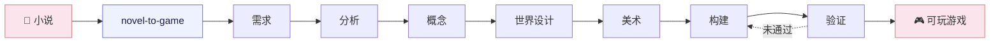

# NovelToGame

> 把任何语言的小说，改编成有原著依据、可完整游玩的游戏。

[](https://github.com/worldwonderer/novel-to-game/actions/workflows/validate.yml)
[](LICENSE)

NovelToGame 是一套面向 Claude Code、Codex 和 Kimi Code 的开源 Agent Skills。它帮助创作者从小说中提炼规则、空间、势力和冲突，再把这些内容设计成玩家动作、系统、关卡与可验证的完整流程。

目标平台由项目需求决定。可玩版本可以是 PC 客户端、移动 App、小程序、网页，也可以直接运行在选定的游戏引擎中；构建和质量验证始终以选定的运行环境为准，替代验证会单独标明范围。

[English](README_EN.md) · [立即安装](#安装) · [快速开始](#快速开始) · [查看产出结构](#产出) · [参与贡献](CONTRIBUTING.md)

## 先玩成品

| 《西游记》· 三借芭蕉扇 | 《金瓶梅》· 风月总账 |
|---|---|
| [](https://xiyouji.vibecoco.ai) | [](https://jinpingmei.vibecoco.ai) |
| 回合制系统 RPG：五行、阵型、变化、携宠与多阶段 Boss | 18+ 关系策略游戏：六日日程、角色意志、资源与人情债、三种结局 |
| **[在线试玩](https://xiyouji.vibecoco.ai)** · [完整项目文件](examples/journey-to-the-west/) · [原著出处](examples/journey-to-the-west/source/SOURCE.md) | **[在线试玩](https://jinpingmei.vibecoco.ai)** · [完整项目文件](examples/jin-ping-mei/) · [原著出处](examples/jin-ping-mei/source/SOURCE.md) |

两份已发布示例都包含原著来源、产品约束、游戏化拆解、方案选择、世界与美术设计、构建说明以及可运行源码。

### 开发中 · Project Plateau: Proof Before Dark

下一份英文参考项目正在用同一流程制作一款实时**第一人称 3D 野外摄影游戏**：穿过连通的高原，观察一群共同生活的禽龙，躲避空中威胁，用四张玻璃底片拍下证据，再把完好的底片带回营地。

| 观察恐龙一家 | 带回营地的玻璃底片 |
|---|---|
| [](game-adaptations/project-plateau/build/evidence/s10/02-young-play-silver-frame.jpg) | [](game-adaptations/project-plateau/build/evidence/s10/05-strong-plate-board.jpg) |
| 两只成年禽龙、三只幼体、会移动的空中威胁，以及可以实际操作的老式相机 | 途中拍到的四个画面会保存在玻璃底片上，并出现在最终记录中 |

**[本地运行](game-adaptations/project-plateau/build/app/RUN.md)** · [可玩源码](game-adaptations/project-plateau/build/app/) · [完整策划文件](game-adaptations/project-plateau/) · [原著出处](game-adaptations/project-plateau/source/SOURCE.md) · [权威验证](game-adaptations/project-plateau/qa/verification.json) · [浏览器证据](game-adaptations/project-plateau/build/evidence/s10/report.json) · [媒体包](game-adaptations/project-plateau/build/media/)

当前展示的是仓库中的开发版本，尚未公开托管；独立首次体验审查和公网环境验证仍待完成。

## 快速开始

安装后，把小说文件、目录或链接交给 Agent：

```text
用 novel-to-game quick 把这本小说改编成一款可完整游玩的游戏。
请根据题材推荐目标平台、类型和引擎，并把首个版本控制在 15 分钟左右。
玩家以原创身份进入世界，不要逐段复演原作剧情。
```

`quick` 会自动选择最有原著依据、也最适合做成完整游戏的方向；想在世界设计之前从三个方案里亲自选择，就使用 `director`。

## 它解决什么

直接让模型“把这本书做成游戏”，经常只会得到换皮玩法或可点击的剧情摘要。NovelToGame 把最需要判断力的工作拆成几个明确阶段：

- **先锁产品边界**：平台、类型、目标体验、画风、分级、引擎和不可改写的要求；
- **再找可玩的原著证据**：规则、动作、空间、角色意志、系统与关键视觉元素；
- **让概念、关卡和美术各自负责**：实现阶段不能静默重做策划；
- **以真实运行收尾**：启动、输入、状态变化、完整流程、结果、重开和目标分辨率或设备都必须留下证据。

输入小说可以是任意语言；生成文件默认使用用户指定的语言，未指定时跟随对话语言，并保留必要的原文引证与术语表。

## 安装

### Agent Skills

为你使用的 CLI 安装全部七个技能：

| Agent CLI | 安装命令 | 调用方式 |
|---|---|---|
| Claude Code | `npx skills add worldwonderer/novel-to-game -g -y -a claude-code -s '*'` | `/novel-to-game` |
| Codex | `npx skills add worldwonderer/novel-to-game -g -y -a codex -s '*'` | `$novel-to-game` |
| Kimi Code | `npx skills add worldwonderer/novel-to-game -g -y -a kimi-code-cli -s '*'` | `/skill:novel-to-game` |

同时安装三端：

```bash
npx skills add worldwonderer/novel-to-game -g -y -s '*' \
  -a claude-code -a codex -a kimi-code-cli
```

克隆仓库后，三端也能发现项目内的七个技能。

### 原生插件

Claude Code：

```text
/plugin marketplace add worldwonderer/novel-to-game
/plugin install novel-to-game@novel-to-game-skills
/novel-to-game:novel-to-game quick
```

Codex：

```bash
codex plugin marketplace add worldwonderer/novel-to-game
codex plugin add novel-to-game@novel-to-game-skills
```

Kimi Code 0.27 或更高版本：

```text
/plugins install https://github.com/worldwonderer/novel-to-game
/reload
/skill:novel-to-game quick
```

## 流程

总入口先确认 `PRODUCT_BRIEF.md`，再串起六个职责分离的阶段；验证失败后会回到构建阶段继续修复，直到证据满足门槛。



需求阶段会锁定平台、实际交付方式、游戏类型与对标、美术方向、内容分级、核心幻想和引擎。下游必须遵守这些边界，不能在实现时悄悄换成更容易做的游戏。

## 七个技能

| 技能 | 职责 |
|---|---|
| `novel-to-game` | 总入口：需求确认、模式选择、阶段编排与进度恢复 |
| `novel-game-analyze` | 提取规则、动作、空间、角色、系统与名场面，形成有引证的设定集 |
| `game-concept` | 生成三个真正不同的方向，排除不合格方案后选出一个 |
| `game-world-design` | 定义玩家体验目标、核心循环、世界响应、系统、关卡、失败与结果 |
| `game-art-direction` | 定义镜头、构图、视觉语法、色光材质、HUD、动效与声音 |
| `game-build` | 压缩构建说明，驱动编码智能体实现可完整游玩的原型 |
| `game-qa` | 用命令、状态、截图与实际游玩路径验证构建，不伪装主观结论 |

## 产出

每次运行创建一个紧凑、自包含的改编工作区：

```text
game-adaptations/<project>/
  PRODUCT_BRIEF.md
  analysis/SOURCE_BIBLE.md
  concepts/CONCEPT.md
  design/GAME_DESIGN.md
  design/ART_DIRECTION.md
  build/BUILD_BRIEF.md
  build/app/
  qa/QA_REPORT.md
  _progress.md
```

核心设计文档不绑定某个模型、平台或游戏引擎；构建阶段会按照已批准的目标平台选择合适实现。

## 示例项目

### 《西游记》· 三借芭蕉扇

这款回合制指令 RPG 从完整公版百回本中提炼五行、阵型、携宠和变化等玩法，让玩家用新的行动路线解决原作中的核心冲突，并完成一场多阶段 Boss 战。

**[在线试玩](https://xiyouji.vibecoco.ai)** · [运行源码](examples/journey-to-the-west/build/app/) · [构建说明](examples/journey-to-the-west/build/BUILD_BRIEF.md) · [QA 报告](examples/journey-to-the-west/qa/QA_REPORT.md)

| 战斗 | 碧波潭 | 主角面板 |
|---|---|---|
|  |  |  |

### 《金瓶梅》· 风月总账

这款六日男性第一人称关系策略游戏改编自公版崇祯本。玩家白日经营钱、势与秘密，夜里推进三条独立关系线，次日面对人物和宅院对前一日选择的回应。

**18+；亲密内容只有在关系选择与双方明确同意后才会出现。** **[在线试玩](https://jinpingmei.vibecoco.ai)** · [运行源码](examples/jin-ping-mei/build/app/) · [构建说明](examples/jin-ping-mei/build/BUILD_BRIEF.md) · [QA 报告](examples/jin-ping-mei/qa/QA_REPORT.md)

| 宅院事件 | 次日清晨 | 中秋冲突 | 专一路线结局 |
|---|---|---|---|
|  |  |  |  |

> 公开 README 只展示安全截图；年龄确认后的 18+ 路线 CG 不嵌入此页。

## 参与贡献

欢迎提交可复现的 Bug、有证据的 Skill 能力缺口和具有新改编价值的示例提案。
请先阅读 [贡献指南](CONTRIBUTING.md)，并使用仓库的结构化 Issue 与 PR 模板。

## 致谢

[linux.do](https://linux.do)
