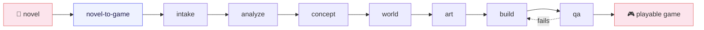

# NovelToGame

> Turn a novel in any language into a source-grounded, fully playable game.

[](https://github.com/worldwonderer/novel-to-game/actions/workflows/validate.yml)
[](LICENSE)

NovelToGame is an open-source Agent Skills toolkit for Claude Code, Codex, and Kimi Code. It extracts the source's own rules, spaces, factions, and conflicts, then turns them into player verbs, systems, levels, and a verifiable complete run.

The project requirements choose the target platform. A playable build may be a PC client, mobile app, mini game, web build, or a project running in the selected game engine. Build and QA use that target runtime; any substitute runtime is scoped separately.

[中文](README.md) · [Install](#install) · [Quick Start](#quick-start) · [See the Output](#output) · [Contributing](CONTRIBUTING.md)

## Play the Games

| Journey to the West · Three Borrowings of the Banana Fan | Jin Ping Mei · Ledger of Desire |
|---|---|
| [](https://xiyouji.vibecoco.ai) | [](https://jinpingmei.vibecoco.ai) |
| Turn-based systems RPG: elements, formations, transformations, companion, and multi-stage boss | 18+ relationship strategy game: six-day schedule, character agency, resource and social debts, and three endings |
| **[Play online](https://xiyouji.vibecoco.ai)** · [Complete project](examples/journey-to-the-west/) · [Source provenance](examples/journey-to-the-west/source/SOURCE.md) | **[Play online](https://jinpingmei.vibecoco.ai)** · [Complete project](examples/jin-ping-mei/) · [Source provenance](examples/jin-ping-mei/source/SOURCE.md) |

Both released examples include source provenance, product constraints, adaptation analysis, concept selection, world and art direction, a build brief, and runnable source.

### In development · Project Plateau: Proof Before Dark

The next English reference project uses the same pipeline to build a real-time **first-person 3D field-photography game**. Cross a connected plateau, observe a family of Iguanodon, avoid an aerial threat, capture evidence on four glass plates, and bring the surviving plates back to camp.

| Observe the dinosaur family | Bring the glass plates home |
|---|---|
| [](game-adaptations/project-plateau/build/evidence/s10/02-young-play-silver-frame.jpg) | [](game-adaptations/project-plateau/build/evidence/s10/05-strong-plate-board.jpg) |
| Two adults, three young, a moving aerial threat, and an operable period camera | Four views captured along the route remain on the plates and appear in the final record |

**[Run locally](game-adaptations/project-plateau/build/app/RUN.md)** · [Playable source](game-adaptations/project-plateau/build/app/) · [Complete planning files](game-adaptations/project-plateau/) · [Source provenance](game-adaptations/project-plateau/source/SOURCE.md) · [Authoritative verification](game-adaptations/project-plateau/qa/verification.json) · [Browser evidence](game-adaptations/project-plateau/build/evidence/s10/report.json) · [Media pack](game-adaptations/project-plateau/build/media/)

This repository contains the current development build. Independent first-time review and public-host verification remain open before a hosted release.

## Quick Start

After installation, give the agent a novel file, directory, or link:

```text
Use novel-to-game quick to adapt this novel into a fully playable game.
Recommend the target platform, genre, and engine from the source, and keep the first build to about 15 minutes.
Let the player enter the world as an original character with a new playable route through its conflict.
```

`quick` automatically selects the direction with the strongest source evidence and the clearest path to a complete game. Use `director` when you want to choose between three concepts before world design begins.

## What It Solves

Ask a model to “make this book into a game” and the result is often a generic reskin or a clickable plot summary. NovelToGame separates the work that requires real adaptation judgment:

- **Lock product boundaries first:** platform, genre, target experience, art, rating, engine, and non-negotiable requirements;
- **Find playable evidence in the source:** rules, verbs, spaces, character agency, systems, and key visual elements;
- **Give concept, level design, and art separate ownership:** implementation may not silently redesign them;
- **Finish with real execution evidence:** startup, input, state changes, complete run, outcome, restart, and target display or device.

Input novels may use any language. Generated files use the requested language, or the conversation language when unspecified, while preserving necessary quotations and one terminology table.

## Install

### Agent Skills

Install all seven skills for the CLI you use:

| Agent CLI | Install command | Invoke |
|---|---|---|
| Claude Code | `npx skills add worldwonderer/novel-to-game -g -y -a claude-code -s '*'` | `/novel-to-game` |
| Codex | `npx skills add worldwonderer/novel-to-game -g -y -a codex -s '*'` | `$novel-to-game` |
| Kimi Code | `npx skills add worldwonderer/novel-to-game -g -y -a kimi-code-cli -s '*'` | `/skill:novel-to-game` |

Install all three adapters at once:

```bash
npx skills add worldwonderer/novel-to-game -g -y -s '*' \
  -a claude-code -a codex -a kimi-code-cli
```

Cloning the repository also enables project-local discovery in all three CLIs.

### Native Plugins

Claude Code:

```text
/plugin marketplace add worldwonderer/novel-to-game
/plugin install novel-to-game@novel-to-game-skills
/novel-to-game:novel-to-game quick
```

Codex:

```bash
codex plugin marketplace add worldwonderer/novel-to-game
codex plugin add novel-to-game@novel-to-game-skills
```

Kimi Code 0.27 or newer:

```text
/plugins install https://github.com/worldwonderer/novel-to-game
/reload
/skill:novel-to-game quick
```

## Pipeline

The orchestrator confirms `PRODUCT_BRIEF.md`, then runs six stages with separate ownership. Failed QA returns to the build for another repair pass until the evidence clears the gate.



Requirements lock the platform, delivery runtime, genre and verified benchmarks, art direction, content rating, core fantasy, and engine. Downstream stages must honor those boundaries instead of switching to an easier game during implementation.

## Seven Skills

| Skill | Purpose |
|---|---|
| `novel-to-game` | Orchestrate requirements, mode selection, stage handoffs, and progress recovery |
| `novel-game-analyze` | Extract cited rules, verbs, spaces, agents, systems, and signature moments |
| `game-concept` | Generate three materially different directions, reject invalid options, and choose one |
| `game-world-design` | Define the target player experience, core loop, world response, systems, levels, failure, and outcomes |
| `game-art-direction` | Define camera, composition, visual grammar, colour, light, materials, HUD, motion, and sound |
| `game-build` | Compress a build brief and drive a coding agent to a fully playable implementation |
| `game-qa` | Verify with commands, states, screenshots, and real play paths without pretending subjective certainty |

## Output

Each run creates a compact, self-contained adaptation workspace:

```text
game-adaptations/<project>/
  PRODUCT_BRIEF.md
  analysis/SOURCE_BIBLE.md
  concepts/CONCEPT.md
  design/GAME_DESIGN.md
  design/ART_DIRECTION.md
  build/BUILD_BRIEF.md
  build/app/
  qa/QA_REPORT.md
  _progress.md
```

Core design documents do not depend on one model, platform, or game engine. The build stage selects an implementation for the approved target platform.

## Example Projects

### Journey to the West · Three Borrowings of the Banana Fan

A turn-based command RPG distilled from the complete 100-chapter public-domain text. The player uses elements, formations, a companion, and transformations to take a new playable route through the source conflict and complete a multi-stage boss encounter.

**[Play online](https://xiyouji.vibecoco.ai)** · [Runnable source](examples/journey-to-the-west/build/app/) · [Build brief](examples/journey-to-the-west/build/BUILD_BRIEF.md) · [QA report](examples/journey-to-the-west/qa/QA_REPORT.md)

| Battle | Emerald Wave Pool | Hero panel |
|---|---|---|
|  |  |  |

### Jin Ping Mei · Ledger of Desire

A six-day, male-POV relationship strategy game adapted from the public-domain 崇祯本. Manage money, influence, and secrets by day, pursue three independent relationships by night, and face how the household responds the following morning.

**18+; intimate content appears only after relationship choices and explicit consent from both parties.** **[Play online](https://jinpingmei.vibecoco.ai)** · [Runnable source](examples/jin-ping-mei/build/app/) · [Build brief](examples/jin-ping-mei/build/BUILD_BRIEF.md) · [QA report](examples/jin-ping-mei/qa/QA_REPORT.md)

| Household event | The next morning | Banquet conflict | Exclusive-route ending |
|---|---|---|---|
|  |  |  |  |

> The public README embeds safe screenshots only. 18+ route CGs remain behind the in-game age gate.

## Contributing

Reproducible bugs, evidenced skill gaps, and example proposals with a distinct
adaptation lesson are welcome. Read the [contribution guide](CONTRIBUTING.md)
and use the repository's structured issue and pull request templates.

## Acknowledgments

[linux.do](https://linux.do)
