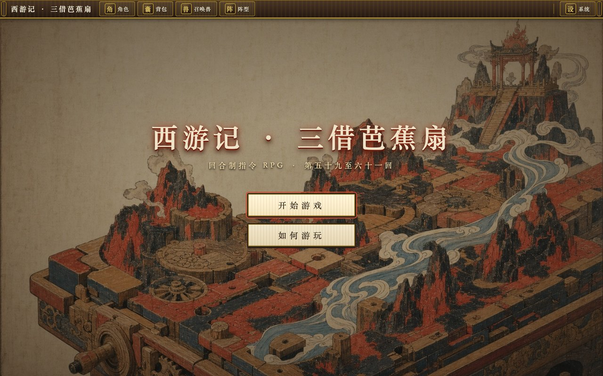
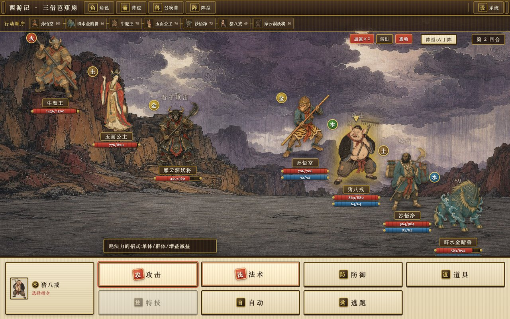
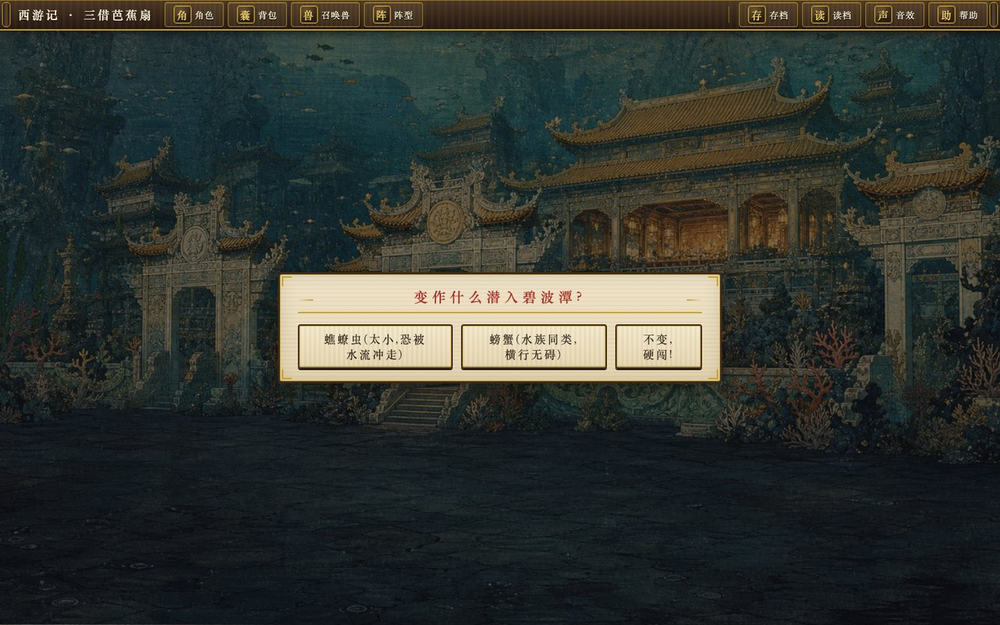
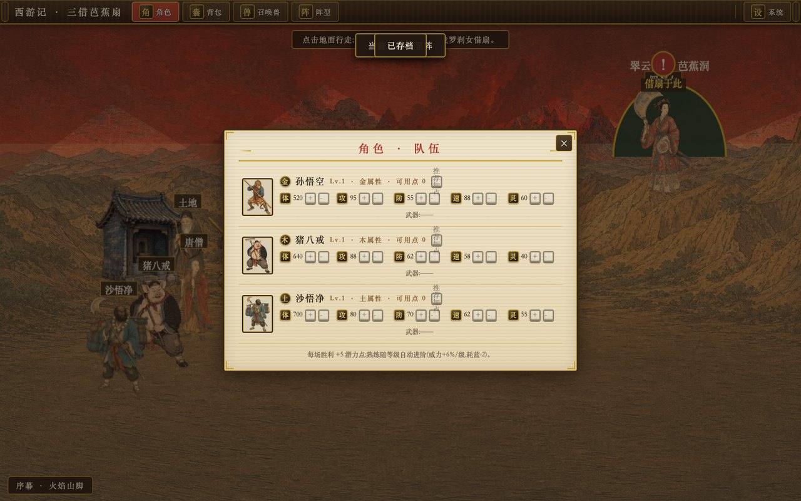
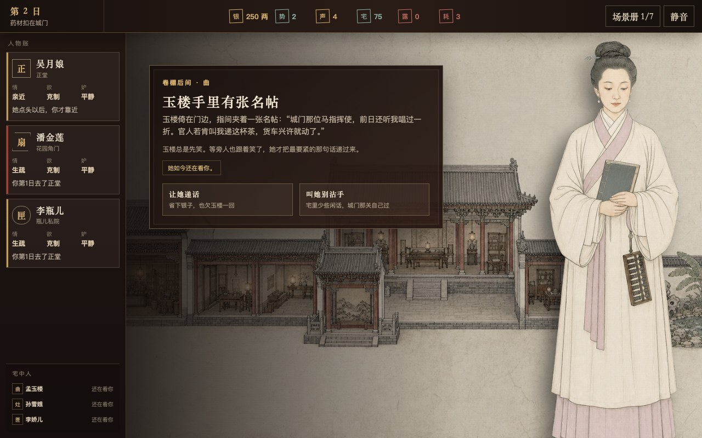
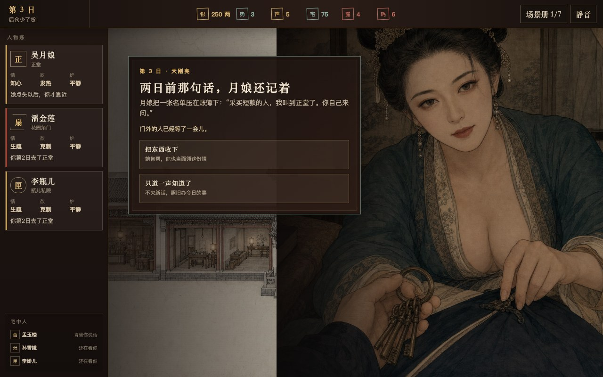
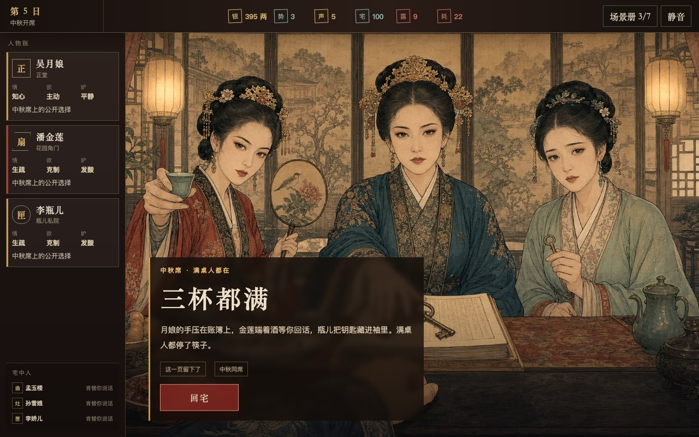
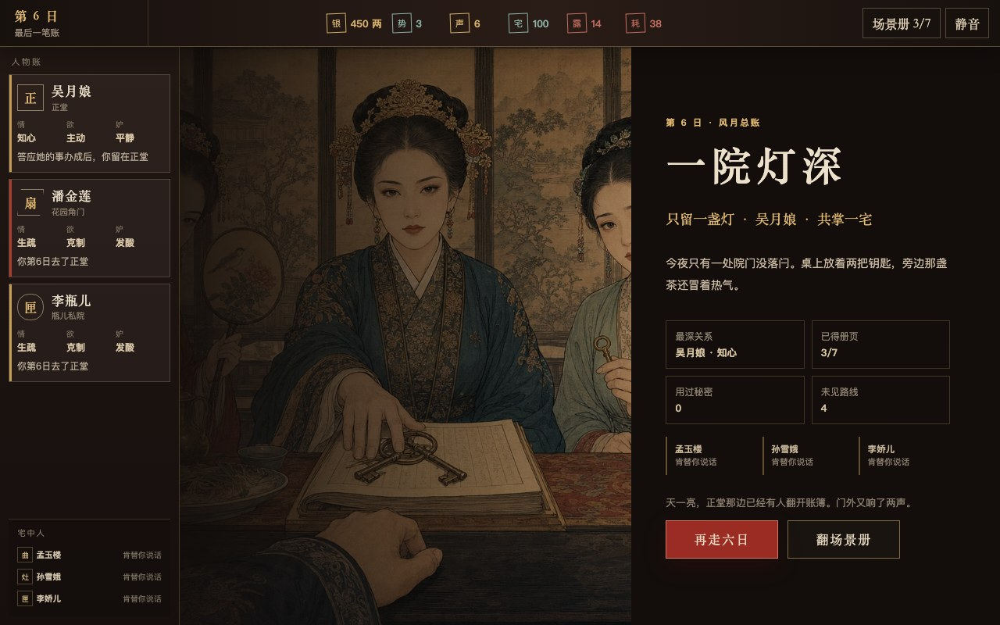

# NovelToGame

> Turn a novel in any language into a source-grounded, fully playable web game.

[](https://github.com/worldwonderer/novel-to-game/actions/workflows/validate.yml)
[](LICENSE)

NovelToGame is an open-source Agent Skills toolkit for Claude Code, Codex, and Kimi Code. It does not pour a book into dialogue boxes. It turns the source's own rules, spaces, factions, and conflicts into player verbs, systems, levels, and a verifiable complete run.

[中文](README.md) · [Install](#install) · [Quick Start](#quick-start) · [See the Output](#output)

## Play the Games

| Journey to the West · Three Borrowings of the Banana Fan | Jin Ping Mei · Ledger of Desire |
|---|---|
| [](https://xiyouji.vibecoco.ai) | [](https://jinpingmei.vibecoco.ai) |
| Turn-based systems RPG: elements, formations, transformations, companion, and multi-stage boss | 18+ relationship strategy game: six-day schedule, character agency, resource debts, and three outcomes |
| **[Play online](https://xiyouji.vibecoco.ai)** · [Full artifacts](examples/journey-to-the-west/) · [Source provenance](examples/journey-to-the-west/source/SOURCE.md) | **[Play online](https://jinpingmei.vibecoco.ai)** · [Full artifacts](examples/jin-ping-mei/) · [Source provenance](examples/jin-ping-mei/source/SOURCE.md) |

Both released examples include source provenance, product constraints, adaptation analysis, concept trade-offs, world and art direction, a build brief, and runnable source.

### In development · Project Plateau: Proof Before Dark

The next English reference build takes the same pipeline into a real-time **first-person 3D survival-photography loop**. Traverse a connected plateau, read a living family, commit four physical glass plates under aerial pressure, and return with the exact views that survived the route.

| Live family frame | Recovered glass plates |
|---|---|
| [](game-adaptations/project-plateau/build/evidence/s10/02-young-play-silver-frame.jpg) | [](game-adaptations/project-plateau/build/evidence/s10/05-strong-plate-board.jpg) |
| Two adults, three young, a moving aerial threat, and a live period camera | Four renderer-derived views preserved through the final field record |

**[Run locally](game-adaptations/project-plateau/build/app/RUN.md)** · [Playable source](game-adaptations/project-plateau/build/app/) · [Planning artifacts](game-adaptations/project-plateau/) · [Source provenance](game-adaptations/project-plateau/source/SOURCE.md) · [Browser evidence](game-adaptations/project-plateau/build/evidence/s10/report.json)

This is a repository checkpoint rather than a hosted release. Independent first-time review and public-host verification remain open.

## Quick Start

After installation, give the agent a novel file, directory, or link:

```text
Turn this novel into a complete 15-minute web game with novel-to-game quick.
The player should enter the world as an original character rather than replay
the protagonist's exact plot.
```

`quick` automatically selects the best-evidenced direction. Use `director` when you want to choose between three concepts before world design begins.

## What It Solves

Ask a model to “make this book into a game” and the result is often a generic reskin or a clickable plot summary. NovelToGame separates the decisions that require real adaptation judgment:

- **Lock product boundaries first:** platform, genre, target experience, art, rating, engine, and non-negotiables;
- **Find playable evidence in the source:** rules, verbs, spaces, character agency, systems, and visual anchors;
- **Give concept, level design, and art separate ownership:** implementation may not silently redesign them;
- **Finish with real execution evidence:** startup, input, state changes, complete run, outcome, restart, and target viewport.

Input novels may use any language. Generated artifacts follow the requested language or the conversation language while preserving necessary quotations and one terminology table.

## Install

### Agent Skills

Install all seven skills for the CLI you use:

| Agent CLI | Install command | Invoke |
|---|---|---|
| Claude Code | `npx skills add worldwonderer/novel-to-game -g -y -a claude-code -s '*'` | `/novel-to-game` |
| Codex | `npx skills add worldwonderer/novel-to-game -g -y -a codex -s '*'` | `$novel-to-game` |
| Kimi Code | `npx skills add worldwonderer/novel-to-game -g -y -a kimi-code-cli -s '*'` | `/skill:novel-to-game` |

Install all three adapters at once:

```bash
npx skills add worldwonderer/novel-to-game -g -y -s '*' \
  -a claude-code -a codex -a kimi-code-cli
```

Cloning the repository also enables project-local discovery in all three CLIs.

### Native Plugins

Claude Code:

```text
/plugin marketplace add worldwonderer/novel-to-game
/plugin install novel-to-game@novel-to-game-skills
/novel-to-game:novel-to-game quick
```

Codex:

```bash
codex plugin marketplace add worldwonderer/novel-to-game
codex plugin add novel-to-game@novel-to-game-skills
```

Kimi Code 0.27 or newer:

```text
/plugins install https://github.com/worldwonderer/novel-to-game
/reload
/skill:novel-to-game quick
```

## Pipeline

The orchestrator freezes `PRODUCT_BRIEF.md`, then runs six stages with separate ownership. Failed QA returns to the build instead of being explained away in prose.


Intake locks the platform, genre and web-verified benchmarks, art direction, content rating, core fantasy, and engine. Downstream stages must honor those boundaries instead of switching to an easier game during implementation.

## Seven Skills

| Skill | Purpose |
|---|---|
| `novel-to-game` | Orchestrate intake, mode selection, stage handoffs, and progress recovery |
| `novel-game-analyze` | Extract cited rules, verbs, spaces, agents, systems, and signature moments |
| `game-concept` | Generate three materially different directions and choose with hard vetoes and trade-offs |
| `game-world-design` | Define the player promise, core loop, world response, systems, levels, failure, and outcomes |
| `game-art-direction` | Define camera, composition, visual grammar, colour, light, materials, HUD, motion, and sound |
| `game-build` | Compress a build brief and drive a coding agent to a fully playable implementation |
| `game-qa` | Verify with commands, states, screenshots, and real play paths without pretending subjective certainty |

## Output

Each run creates a compact, self-contained adaptation workspace:

```text
game-adaptations/<project>/
  PRODUCT_BRIEF.md
  analysis/SOURCE_BIBLE.md
  concepts/CONCEPT.md
  design/GAME_DESIGN.md
  design/ART_DIRECTION.md
  build/BUILD_BRIEF.md
  build/app/
  qa/QA_REPORT.md
  _progress.md
```

Core design artifacts do not depend on one model or frontend framework. The build stage chooses an implementation only after the design is approved.

## Example Artifacts

### Journey to the West · Three Borrowings of the Banana Fan

A turn-based command RPG distilled from the complete 100-chapter public-domain text. Rather than replaying the novel, the player uses elements, formations, a companion, and transformations to complete a new loop across a multi-stage boss encounter.

**[Play online](https://xiyouji.vibecoco.ai)** · [Runnable source](examples/journey-to-the-west/build/app/) · [Build brief](examples/journey-to-the-west/build/BUILD_BRIEF.md) · [QA report](examples/journey-to-the-west/qa/QA_REPORT.md)

| Battle | Emerald Wave Pool | Hero panel |
|---|---|---|
|  |  |  |

### Jin Ping Mei · Ledger of Desire

A six-day, male-POV relationship strategy game adapted from the public-domain 崇祯本. Manage money, influence, and secrets by day, pursue three independent long routes by night, and face how the household responds the following morning.

**18+; intimate content is gated by relationship choices and explicit consent.** **[Play online](https://jinpingmei.vibecoco.ai)** · [Runnable source](examples/jin-ping-mei/build/app/) · [Build brief](examples/jin-ping-mei/build/BUILD_BRIEF.md) · [QA report](examples/jin-ping-mei/qa/QA_REPORT.md)

| Household side story | Morning consequence | Banquet conflict | Exclusive-route ending |
|---|---|---|---|
|  |  |  |  |

> The public README embeds safe screenshots only. 18+ route CGs remain behind the in-game age gate.

## Acknowledgments

[linux.do](https://linux.do)
